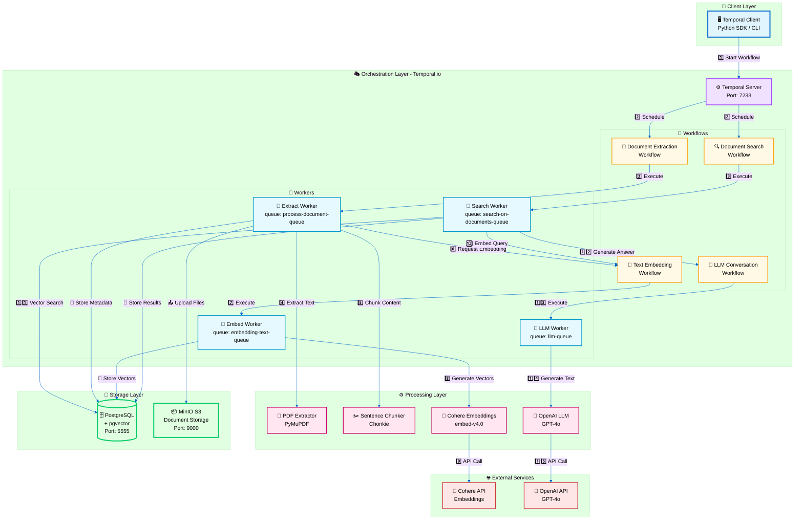
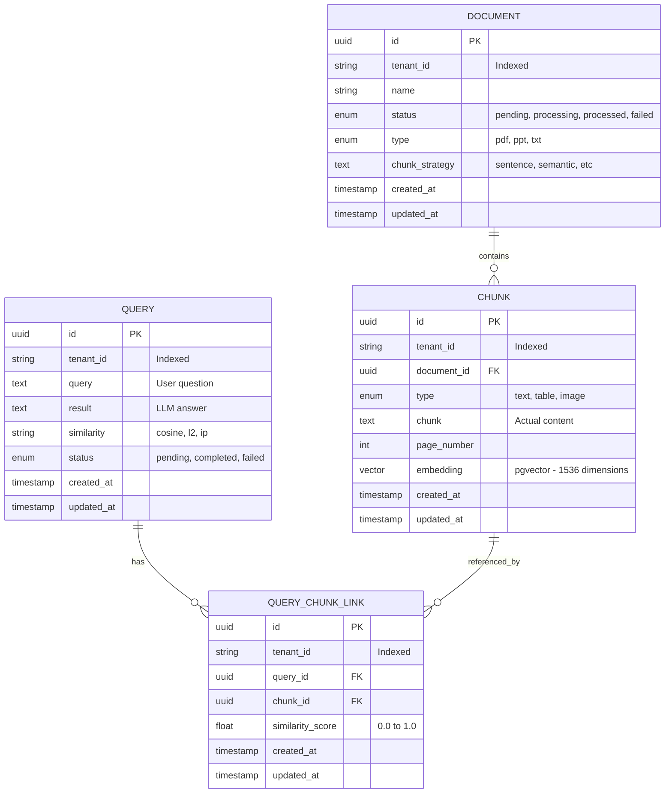
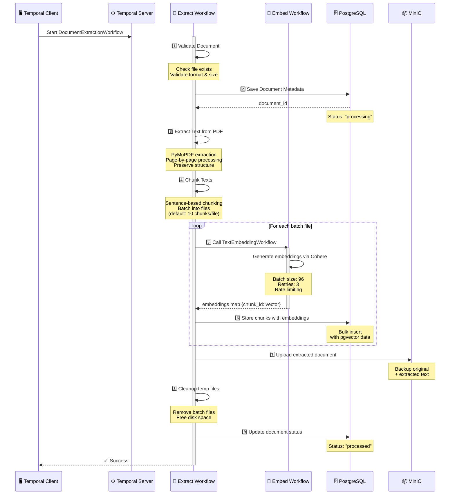
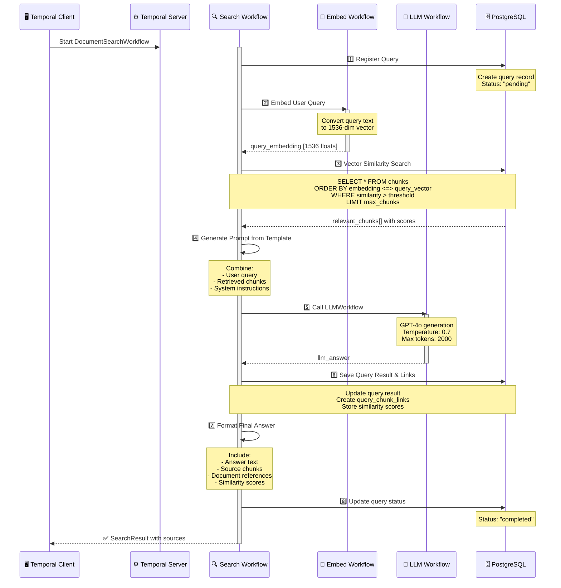

# GDAI: Multi-Tenant Vector Store with Auditable Semantic Search

GDAI is an open-source platform designed to provide a robust, multi-tenant vector store with advanced document processing and semantic search capabilities. It leverages Retrieval-Augmented Generation (RAG) and Temporal.io workflows to deliver accurate, auditable answers with full source traceability.

[](https://github.com/winnin/gdai/actions/workflows/tests.yml)
[](https://github.com/winnin/gdai/actions/workflows/pre-commit.yml)
[](https://codecov.io/gh/winnin/gdai)


---

## 📑 Table of Contents

- [Purpose](#-purpose)
- [Key Features](#-key-features)
- [Quick Start](#-quick-start)
- [Architecture](#%EF%B8%8F-architecture)
  - [System Overview](#system-overview)
  - [Database Schema](#database-schema)
  - [Workflow Orchestration](#workflow-orchestration)
- [Development Setup](#-development-setup)
  - [Prerequisites](#prerequisites)
  - [Step-by-Step Setup](#step-by-step-setup)
  - [Available Commands](#available-commands)
  - [Verifying Services](#verifying-services)
  - [Environment Variables](#environment-variables)
  - [Troubleshooting](#troubleshooting)
- [Triggering Workflows](#-triggering-workflows)
- [Deployment](#-deployment)
- [Testing](#-testing)
- [Documentation](#-documentation)
- [Contributing](#-contributing)

---

## 🎯 Purpose

- **Multi-Tenant Vector Store:** Manage isolated data and search spaces for multiple organizations or users.
- **Semantic Document Processing:** Go beyond RAG by incorporating various semantic approaches for document understanding and retrieval.
- **Auditable Answers:** Every answer is traceable to its source, ensuring transparency and trust.
- **Workflow Orchestration:** Temporal.io workflows provide reliable, scalable, and observable document processing pipelines.

---

## ✨ Key Features

- **🏢 Tenant Management:** Complete data isolation for different clients or projects
- **📄 Document Ingestion:** Process and embed documents from various formats (PDF, and more coming)
- **🔍 Semantic Search:** Vector similarity search with pgvector and advanced semantic techniques
- **🤖 RAG (Retrieval-Augmented Generation):** Combine retrieval with OpenAI models for context-aware answers
- **📊 Source Traceability:** Every answer includes references to original documents and locations
- **🔄 Workflow-Based Processing:** Temporal.io workflows for reliable, scalable document processing
- **📈 Auditing:** Built-in mechanisms to audit and review the provenance of answers
- **🔌 Programmable:** Trigger workflows programmatically via Temporal Python client

---

## ⚡ Quick Start

**For the impatient developer** - Get GDAI running in under 5 minutes:

```bash
# 1. Clone and setup
git clone https://github.com/winnin/gdai.git
cd gdai
uv venv && source .venv/bin/activate
uv sync --all-groups

# 2. Configure environment
cp .env.example .env
# Edit .env with your API keys (EMBEDDING_API_KEY, LLM_API_KEY)

# 3. Start everything
task configure-dev      # Setup development environment
docker compose up -d    # Start infrastructure services
task setup-db           # Initialize database
task temporal-all       # Start all Temporal workers
```

**Access Points:**

- 🌐 Temporal UI: http://localhost:8233
- 💾 PostgreSQL: localhost:5555
- 📦 MinIO Console: http://localhost:9001

**Next Steps:** Jump to [Triggering Workflows](#-triggering-workflows) to start processing documents!

---

## 🏗️ Architecture

### Why These Technologies?

**🎯 Why Temporal?**

- **Reliability:** Built-in retries, timeouts, and error handling
- **Observability:** Visual workflow execution tracking and debugging
- **Scalability:** Horizontally scalable workers with queue-based task distribution
- **Maintainability:** Clear separation of business logic from infrastructure concerns

**🎯 Why pgvector?**

- **Performance:** Native PostgreSQL extension for vector operations
- **Simplicity:** No need for separate vector database infrastructure
- **ACID Compliance:** Full transactional support for metadata and vectors
- **Cost-Effective:** Leverage existing PostgreSQL expertise and tooling

**🎯 Why Cohere Embeddings?**

- **Quality:** State-of-the-art embed-v4.0 model with 1536 dimensions
- **Multilingual:** Support for 100+ languages
- **Semantic Compression:** Better representation of document meaning

**🎯 Why OpenAI GPT-4o?**

- **Reasoning:** Superior context understanding and answer generation
- **Consistency:** Reliable output quality for production use
- **Integration:** Well-documented API and extensive ecosystem

---

### System Overview



#### Legend

| Symbol  | Component Type | Description                                      |
| ------- | -------------- | ------------------------------------------------ |
| 📱      | Client Layer   | User-facing interface for triggering workflows   |
| 🎭      | Orchestration  | Temporal server and workflow definitions         |
| 👷      | Workers        | Long-running processes that execute activities   |
| ⚙️      | Processing     | Business logic for extraction, embedding, LLM    |
| 💾      | Storage        | Persistent data storage (database, object store) |
| 🌐      | External       | Third-party API services                         |
| 1️⃣-1️⃣5️⃣ | Flow Steps     | Numbered execution sequence                      |

---

### Component Breakdown

| Layer             | Components                            | Technology                       | Purpose                                 |
| ----------------- | ------------------------------------- | -------------------------------- | --------------------------------------- |
| **Client**        | Python SDK, CLI                       | Temporal Client                  | Trigger and monitor workflows           |
| **Orchestration** | Workflow Engine, Workers              | Temporal.io                      | Reliable, distributed task execution    |
| **Processing**    | Extractors, Chunkers, Embedders, LLMs | PyMuPDF, Chonkie, Cohere, OpenAI | Document understanding and generation   |
| **Storage**       | Relational + Vector DB, Object Store  | PostgreSQL + pgvector, MinIO     | Persistent metadata, vectors, and files |
| **External**      | Embedding & LLM APIs                  | Cohere, OpenAI                   | AI model inference                      |

---

### Database Schema



#### Multi-Tenancy

All tables include a `tenant_id` column (indexed) to ensure complete data isolation between tenants. Every workflow execution is scoped by tenant ID to maintain data boundaries.

#### Vector Search

The `chunk.embedding` column uses pgvector with HNSW index for fast approximate nearest neighbor search:

```sql
CREATE INDEX ON chunk USING hnsw (embedding vector_cosine_ops);
```

**Performance Characteristics:**

- **Index Type:** HNSW (Hierarchical Navigable Small World)
- **Distance Metric:** Cosine similarity (configurable: L2, inner product)
- **Query Time:** ~10-50ms for 1M vectors (depends on dataset)
- **Index Build Time:** ~1-5 seconds per 10K vectors

---

### Workflow Orchestration

#### Document Extraction Workflow



#### Search Workflow



#### Temporal Workers

Each workflow runs on dedicated worker queues for scalability and isolation:

| Worker         | Queue                       | Workflow                   | Purpose                        | Scaling Strategy             |
| -------------- | --------------------------- | -------------------------- | ------------------------------ | ---------------------------- |
| Extract Worker | `process-document-queue`    | DocumentExtractionWorkflow | PDF extraction, chunking       | CPU-bound, scale for volume  |
| Embed Worker   | `embedding-text-queue`      | TextEmbeddingWorkflow      | Generate embeddings via Cohere | API rate-limited             |
| Search Worker  | `search-on-documents-queue` | DocumentSearchWorkflow     | Semantic search + RAG          | I/O-bound, scale for latency |
| LLM Worker     | `llm-queue`                 | LLMWorkflow                | Generate answers via OpenAI    | API rate-limited             |

**Worker Scalability:**

- Each worker can be run as a separate process
- Horizontal scaling: Run multiple instances of the same worker
- Queue-based load distribution automatically balances work
- No shared state between workers (stateless)

---

## 🚀 Development Setup

### Prerequisites

Before you begin, ensure you have the following installed:

| Tool               | Version | Purpose                       | Installation                                      |
| ------------------ | ------- | ----------------------------- | ------------------------------------------------- | --- |
| **Python**         | 3.12+   | Runtime environment           | [python.org](https://www.python.org/downloads/)   |
| **uv**             | Latest  | Fast Python package installer | `curl -LsSf https://astral.sh/uv/install.sh       | sh` |
| **Docker**         | 20.10+  | Container runtime             | [docker.com](https://docs.docker.com/get-docker/) |
| **Docker Compose** | 2.0+    | Multi-container orchestration | Included with Docker Desktop                      |
| **Git**            | 2.30+   | Version control               | [git-scm.com](https://git-scm.com/downloads)      |

**API Keys Required:**

- **Cohere API Key** - For text embeddings ([Get one here](https://cohere.ai/))
- **OpenAI API Key** - For LLM generation ([Get one here](https://platform.openai.com/))

**System Requirements:**

- RAM: Minimum 8GB (16GB recommended)
- Disk: 10GB free space
- OS: Linux, macOS, or Windows with WSL2

---

### Step-by-Step Setup

#### 1. Clone the Repository

```bash
git clone https://github.com/winnin/gdai.git
cd gdai
```

#### 2. Create Virtual Environment

```bash
# Create virtual environment with uv
uv venv

# Activate virtual environment
source .venv/bin/activate  # On Linux/macOS
# OR
.venv\Scripts\activate     # On Windows
```

#### 3. Install Dependencies

```bash
# Install all dependencies including dev tools
uv sync --all-groups

# This installs:
# - Core dependencies (Temporal, FastAPI, SQLAlchemy, etc.)
# - Dev tools (pytest, ruff, mypy, pre-commit)
# - Integration testing tools
```

#### 4. Configure Development Environment

```bash
task configure-dev
```

This command will:

- ✅ Sync all Python dependencies
- ✅ Install pre-commit hooks (code formatting, linting)
- ✅ Install pre-push hooks (run tests before push)
- ✅ Validate your development environment

#### 5. Set Up Environment Variables

```bash
# Copy example environment file
cp .env.example .env

# Edit .env with your favorite editor
nano .env  # or vim, code, etc.
```

**Required Variables:**

```bash
# API Keys (REQUIRED)
EMBEDDING_API_KEY=your-cohere-api-key-here
LLM_API_KEY=your-openai-api-key-here

# Database Configuration
DATABASE=pgvector
PGVECTOR_USER=testuser
PGVECTOR_PASSWORD=testpwd
PGVECTOR_DATABASE=vectordb
PGVECTOR_HOST=localhost
PGVECTOR_PORT=5555

# Temporal Configuration (defaults should work)
TEMPORAL_HOST=localhost
TEMPORAL_PORT=7233
```

See [Environment Variables](#environment-variables) section for complete reference.

#### 6. Start Infrastructure Services

```bash
# Start all infrastructure services in detached mode
docker compose up -d
```

This starts:

- ✅ **PostgreSQL + pgvector** (port 5555)
- ✅ **Temporal Server** (port 7233)
- ✅ **Temporal Web UI** (port 8233)
- ✅ **MinIO S3** (ports 9000, 9001)
- ✅ **Temporal Admin Tools** (port 8088)

**Verify Services:**

```bash
# Check all containers are running
docker compose ps

# Expected output:
# NAME                 STATUS
# gdai-postgres-1      Up (healthy)
# gdai-temporal-1      Up (healthy)
# gdai-temporal-ui-1   Up
# gdai-minio-1         Up (healthy)
```

#### 7. Initialize Database

```bash
# Create database tables and indexes
task setup-db
```

This command will:

- ✅ Create all database tables (documents, chunks, queries, etc.)
- ✅ Install pgvector extension
- ✅ Create HNSW indexes for vector search
- ✅ Set up multi-tenant indexes

**Verify Database:**

```bash
# Connect to PostgreSQL
docker compose exec postgres psql -U testuser -d vectordb

# List tables
\dt

# Expected tables: document, chunk, query, query_chunk_link
```

#### 8. Start Temporal Workers

```bash
# Start all workers in a single terminal
task temporal-all
```

This starts **all 4 workers**:

- ✅ **Extract Worker** - Processes document extraction tasks
- ✅ **Embed Worker** - Generates embeddings via Cohere
- ✅ **Search Worker** - Handles semantic search queries
- ✅ **LLM Worker** - Generates answers via OpenAI

**You should see:**

```
[INFO] Starting all Temporal workers...
[INFO] LLM Worker started on queue: llm-queue
[INFO] Embed Worker started on queue: embedding-text-queue
[INFO] Extract Worker started on queue: process-document-queue
[INFO] Search Worker started on queue: search-on-documents-queue
```

**Alternative: Run Workers Individually**

For debugging or development, run workers in separate terminals:

```bash
# Terminal 1: Extract worker
task temporal-extract

# Terminal 2: Embed worker
task temporal-embed

# Terminal 3: Search worker
task temporal-search

# Terminal 4: LLM worker
task temporal-llm
```

#### 9. Verify Installation

**Access Temporal Web UI:**

Open your browser to [http://localhost:8233](http://localhost:8233)

You should see:

- ✅ Temporal dashboard
- ✅ Four task queues visible
- ✅ Workers connected to each queue

**Run Quick Test:**

```bash
task tests-quick
```

This runs unit tests (~3 seconds) to verify your installation.

---

### Available Commands

GDAI uses [taskipy](https://github.com/taskipy/taskipy) for task management. All commands are defined in `pyproject.toml`.

#### Development Commands

| Command              | Description                            | Use Case                                   |
| -------------------- | -------------------------------------- | ------------------------------------------ |
| `task configure-dev` | Setup development environment          | First-time setup, after pulling changes    |
| `task dev`           | Start complete development environment | All-in-one: infrastructure + workers + API |
| `task dev-infra`     | Start infrastructure services only     | Just PostgreSQL, Temporal, MinIO           |

#### Database Commands

| Command         | Description                           | ⚠️ Warning                          |
| --------------- | ------------------------------------- | ----------------------------------- |
| `task setup-db` | Create database tables and indexes    | Safe - idempotent operation         |
| `task reset-db` | **DROP ALL DATA** and recreate tables | 🚨 **DANGER** - Deletes everything! |

#### Testing Commands

| Command                  | Description                         | Duration | When to Use                        |
| ------------------------ | ----------------------------------- | -------- | ---------------------------------- |
| `task tests`             | Run all tests with coverage report  | ~30s     | Before committing, CI/CD           |
| `task tests-quick`       | Run unit tests only (no coverage)   | ~3s      | During development, rapid feedback |
| `task tests-unit`        | Run unit tests with coverage        | ~10s     | Testing business logic             |
| `task tests-integration` | Run integration tests with coverage | ~20s     | Testing external integrations      |

#### Temporal Worker Commands

| Command                 | Description                           | Queue Name                  |
| ----------------------- | ------------------------------------- | --------------------------- |
| `task temporal-all`     | Run **all** workers in single process | All queues                  |
| `task temporal-extract` | Run document extraction worker        | `process-document-queue`    |
| `task temporal-embed`   | Run embedding worker                  | `embedding-text-queue`      |
| `task temporal-search`  | Run search worker                     | `search-on-documents-queue` |
| `task temporal-llm`     | Run LLM conversation worker           | `llm-queue`                 |

---

### Verifying Services

#### Check PostgreSQL

```bash
# Connect to database
docker compose exec postgres psql -U testuser -d vectordb

# Check pgvector extension
SELECT * FROM pg_extension WHERE extname = 'vector';

# List tables
\dt

# Check a table structure
\d document

# Exit
\q
```

#### Check Temporal Server

```bash
# Check Temporal server health
curl http://localhost:7233/health

# Expected: 200 OK

# List namespaces
temporal operator namespace list

# Expected: default namespace
```

#### Check Temporal UI

Open [http://localhost:8233](http://localhost:8233)

You should see:

- ✅ Workflows page (empty if no workflows run yet)
- ✅ Task queues (4 queues visible)
- ✅ Workers connected to queues (green indicators)

#### Check MinIO

Open [http://localhost:9001](http://localhost:9001)

Login credentials:

- **Username:** `minioadmin`
- **Password:** `minioadmin`

You should see:

- ✅ MinIO dashboard
- ✅ Buckets (created on first document upload)

#### Check Workers

Workers should log activity:

```bash
# Check worker logs
task temporal-all

# Expected output:
[INFO] Starting worker on queue: process-document-queue
[INFO] Starting worker on queue: embedding-text-queue
[INFO] Starting worker on queue: search-on-documents-queue
[INFO] Starting worker on queue: llm-queue
```

---

### Environment Variables

Complete reference for `.env` configuration:

#### Logging Configuration

```bash
GDAI_LOG_LEVEL=DEBUG                      # DEBUG | INFO | WARNING | ERROR
GDAI_LOG_FORMAT=[%(asctime)s] [GDAI] [%(levelname)s]: %(message)s
GDAI_LOG_FILE_ENABLED=false               # Enable file logging
GDAI_LOG_FILE_PATH=PROJECT_PATH/gdai/logs/gdai.log
GDAI_LOG_FILE_MAX_SIZE_MB=10              # Log rotation size
GDAI_LOG_FILE_BACKUP_COUNT=5              # Number of backup files
```

#### Database Configuration

```bash
DATABASE=pgvector                         # Database type (pgvector or turso)
PGVECTOR_USER=testuser                    # PostgreSQL username
PGVECTOR_PASSWORD=testpwd                 # PostgreSQL password
PGVECTOR_DATABASE=vectordb                # Database name
PGVECTOR_HOST=localhost                   # Database host
PGVECTOR_PORT=5555                        # Database port
PGVECTOR_MIN_POOL_CONNECTIONS=2           # Connection pool minimum
PGVECTOR_MAX_POOL_CONNECTIONS=10          # Connection pool maximum
```

**Connection Pool Sizing:**

- **Min:** Start with 2 connections per worker
- **Max:** Total workers × 5 (e.g., 4 workers → 20 max connections)
- **Rule of thumb:** `max_connections = num_workers * 5`

#### Document Processing Configuration

```bash
DOCUMENT_EXTRACTOR_FOLDER_SOURCE_PATH=PROJECT_PATH/gdai/DOC_FOLDER/raw
DOCUMENT_EXTRACTOR_MAX_FILE_SIZE_MB=100   # Maximum PDF size
DOCUMENT_EXTRACT_BATCH_SIZE=10            # Chunks per batch file
```

**Batch Size Recommendations:**

- **Small documents:** 10 chunks/batch (default)
- **Large documents:** 50-100 chunks/batch
- **Trade-off:** Larger batches = fewer API calls but more memory

#### Embedding Configuration

```bash
EMBEDDING_MAX_TEXT_SIZE=5000              # Max characters per chunk
EMBEDDING_MAX_RETRIES=3                   # Retry failed API calls
EMBEDDING_MODEL=cohere/embed-v4.0         # Cohere embedding model
EMBEDDING_API_KEY=your-cohere-api-key     # 🔑 REQUIRED
EMBEDDING_DIMENSION=1536                  # Vector dimensions
EMBEDDING_BATCH_SIZE=96                   # Embeddings per API call
```

**API Rate Limits:**

- **Cohere Trial:** 100 requests/minute
- **Cohere Production:** 10,000 requests/minute
- **Batch size:** 96 texts per request (Cohere limit)

#### LLM Configuration

```bash
LLM_MODEL=openai/gpt-4o                   # OpenAI model
LLM_API_KEY=your-openai-api-key           # 🔑 REQUIRED
LLM_MAX_TOKENS=2000                       # Max response length
LLM_TEMPERATURE=0.7                       # Randomness (0.0-1.0)
```

**Temperature Guide:**

- **0.0-0.3:** Deterministic, factual answers
- **0.4-0.7:** Balanced creativity (recommended)
- **0.8-1.0:** More creative, less predictable

---

### Troubleshooting

#### Workers not connecting to Temporal

**Symptom:** Workers start but don't appear in Temporal UI

**Solution:**

```bash
# 1. Check Temporal server is running
docker compose ps temporal

# 2. Check Temporal server logs
docker compose logs temporal

# 3. Verify Temporal server health
curl http://localhost:7233/health

# 4. Restart Temporal server
docker compose restart temporal

# 5. Restart workers
# Stop with Ctrl+C, then:
task temporal-all
```

#### Database connection errors

**Symptom:** `ConnectionError: could not connect to server`

**Solution:**

```bash
# 1. Check PostgreSQL is running
docker compose ps postgres

# 2. Check PostgreSQL logs
docker compose logs postgres

# 3. Verify PostgreSQL is healthy
docker compose exec postgres pg_isready

# 4. Test connection
docker compose exec postgres psql -U testuser -d vectordb -c "SELECT 1;"

# 5. Recreate database
task reset-db
task setup-db
```

#### API key errors

**Symptom:** `AuthenticationError: Invalid API key`

**Solution:**

```bash
# 1. Check .env file exists
cat .env | grep API_KEY

# 2. Verify API keys are set (should not be empty)
echo $EMBEDDING_API_KEY
echo $LLM_API_KEY

# 3. Test Cohere API key
curl -X POST https://api.cohere.ai/v1/embed \
  -H "Authorization: Bearer $EMBEDDING_API_KEY" \
  -H "Content-Type: application/json" \
  -d '{"texts": ["test"], "model": "embed-english-v3.0"}'

# 4. Test OpenAI API key
curl https://api.openai.com/v1/models \
  -H "Authorization: Bearer $LLM_API_KEY"
```

#### Port conflicts

**Symptom:** `Error: port 5555 is already in use`

**Solution:**

```bash
# 1. Check what's using the port
lsof -i :5555  # On Linux/macOS
netstat -ano | findstr :5555  # On Windows

# 2. Stop conflicting service or change port in .env
# Edit .env:
PGVECTOR_PORT=5556  # Use different port

# 3. Update docker-compose.yml if needed

# 4. Restart services
docker compose down
docker compose up -d
```

#### Out of memory errors

**Symptom:** `MemoryError` or workers crashing

**Solution:**

```bash
# 1. Reduce batch sizes in .env
DOCUMENT_EXTRACT_BATCH_SIZE=5      # Reduce from 10
EMBEDDING_BATCH_SIZE=48            # Reduce from 96

# 2. Reduce connection pool
PGVECTOR_MAX_POOL_CONNECTIONS=5    # Reduce from 10

# 3. Run workers individually (not all at once)
task temporal-extract  # In terminal 1
task temporal-embed    # In terminal 2
# etc.

# 4. Increase Docker memory limit
# Docker Desktop → Settings → Resources → Memory: 8GB+
```

#### Tests failing

**Symptom:** `pytest` failures

**Solution:**

```bash
# 1. Ensure infrastructure is running
docker compose ps

# 2. Reset database
task reset-db
task setup-db

# 3. Check API keys are set
cat .env | grep API_KEY

# 4. Run tests with verbose output
task tests-quick -v

# 5. Run specific test file
pytest tests/unit/test_extractors.py -v

# 6. Check pre-commit hooks
pre-commit run --all-files
```

#### Temporal workflows stuck

**Symptom:** Workflows in "Running" state forever

**Solution:**

```bash
# 1. Check worker logs for errors
task temporal-all  # Check console output

# 2. Check Temporal UI for error details
# Open http://localhost:8233
# Click on stuck workflow → View error

# 3. Terminate stuck workflow
temporal workflow terminate --workflow-id <workflow-id>

# 4. Reset Temporal server (⚠️ loses workflow history)
docker compose down temporal
docker compose up -d temporal
```

---

## 🔌 Triggering Workflows

GDAI is a workflow-based processing system. You can trigger workflows programmatically using the Temporal Python client or via the Temporal CLI.

### Available Workflows

| Workflow                     | Purpose                     | Queue                       | When to Use               |
| ---------------------------- | --------------------------- | --------------------------- | ------------------------- |
| `DocumentExtractionWorkflow` | Extract and embed documents | `process-document-queue`    | Upload new PDFs to system |
| `DocumentSearchWorkflow`     | Semantic search + RAG       | `search-on-documents-queue` | Query documents with AI   |
| `ListDocumentsWorkflow`      | List all documents          | `document-management-queue` | View available documents  |
| `GetDocumentWorkflow`        | Get document details        | `document-management-queue` | Check document metadata   |
| `DeleteDocumentWorkflow`     | Delete document + chunks    | `document-management-queue` | Remove documents          |
| `GetDocumentChunksWorkflow`  | Get all chunks              | `document-management-queue` | Inspect chunking results  |

---

### Using the Temporal Python Client

#### 1. Document Processing Example

Extract text, chunk, and embed a PDF document:

```python
from temporalio.client import Client
from gdai.temporal.extract_document.workflow import DocumentExtractionWorkflow
from gdai.temporal.extract_document.schema import DocumentExtracInput

async def process_document():
    """Extract and embed a PDF document."""
    # Connect to Temporal server
    client = await Client.connect("localhost:7233")

    # Prepare workflow input
    workflow_input = DocumentExtracInput(
        tenant_id="my-tenant",
        document_path="/path/to/document.pdf",
        chunk_strategy="sentence"  # Options: sentence, semantic
    )

    # Start the workflow
    handle = await client.start_workflow(
        DocumentExtractionWorkflow.run,
        workflow_input,
        id=f"document-extraction-{uuid.uuid4()}",
        task_queue="process-document-queue"
    )

    # Wait for completion (async)
    result = await handle.result()
    print(f"✅ Document processed: {result}")
    return result

# Run the workflow
import asyncio
asyncio.run(process_document())
```

**Expected Output:**

```
✅ Document processed: Document /path/to/document.pdf processed successfully.
```

**What Happens:**

1. Document is validated (file exists, size OK, format supported)
2. Metadata saved to database (status: "processing")
3. PDF extracted page-by-page with PyMuPDF
4. Text chunked into sentences (or semantic chunks)
5. Chunks batched (default: 10 chunks per file)
6. Each batch sent to embedding workflow
7. Chunks with embeddings stored in PostgreSQL
8. Temporary files cleaned up
9. Document status updated to "processed"

---

#### 2. Semantic Search Example

Query documents with natural language:

```python
from temporalio.client import Client
from gdai.temporal.search_on_documents.workflow import DocumentSearchWorkflow
from gdai.temporal.search_on_documents.schema import SearchInput
import uuid

async def search_documents():
    """Search documents using semantic similarity."""
    # Connect to Temporal server
    client = await Client.connect("localhost:7233")

    # Generate unique query ID
    query_id = str(uuid.uuid4())

    # Prepare search input
    search_input = SearchInput(
        query_id=query_id,
        tenant_id="my-tenant",
        query="What are the main findings in the research?",
        max_num_chunks=5,                    # Top 5 most relevant chunks
        similarity_threshold=0.7,             # 70% similarity minimum
        document_ids=None                     # Search all documents (or specify IDs)
    )

    # Start the search workflow
    handle = await client.start_workflow(
        DocumentSearchWorkflow.run,
        search_input,
        id=f"search-{query_id}",
        task_queue="search-on-documents-queue"
    )

    # Wait for results
    result = await handle.result()

    # Process results
    print(f"🤖 Answer: {result.answer}\n")
    print(f"📚 Sources ({len(result.chunks)} chunks):\n")

    for i, chunk in enumerate(result.chunks, 1):
        print(f"  {i}. Document ID: {chunk.document_id}")
        print(f"     Page: {chunk.page_number}")
        print(f"     Similarity: {chunk.query_similarity:.3f}")
        print(f"     Text: {chunk.text[:100]}...\n")

    return result

# Run the search
import asyncio
result = asyncio.run(search_documents())
```

**Expected Output:**

```
🤖 Answer: Based on the research documents, the main findings indicate that...

📚 Sources (5 chunks):

  1. Document ID: 123e4567-e89b-12d3-a456-426614174000
     Page: 3
     Similarity: 0.892
     Text: The primary outcome of this study demonstrates that the proposed method...

  2. Document ID: 123e4567-e89b-12d3-a456-426614174000
     Page: 5
     Similarity: 0.856
     Text: Our findings suggest a significant correlation between variables...

  ...
```

**What Happens:**

1. Query registered in database (status: "pending")
2. Query text embedded via Cohere (→ 1536-dim vector)
3. Vector similarity search in PostgreSQL with pgvector
4. Top N chunks retrieved above similarity threshold
5. Prompt generated from template (query + chunks + instructions)
6. LLM generates answer via OpenAI GPT-4o
7. Answer and chunk links saved to database
8. Result formatted with source attribution
9. Query status updated to "completed"

---

#### 3. List Documents Example

List all documents for a tenant:

```python
from temporalio.client import Client
from gdai.temporal.document_management.workflow import ListDocumentsWorkflow
from gdai.temporal.document_management.schema import ListDocumentsInput

async def list_documents():
    """List all documents for a tenant."""
    client = await Client.connect("localhost:7233")

    input_data = ListDocumentsInput(tenant_id="my-tenant")

    handle = await client.start_workflow(
        ListDocumentsWorkflow.run,
        input_data,
        id=f"list-documents-{uuid.uuid4()}",
        task_queue="document-management-queue"
    )

    result = await handle.result()

    print(f"📁 Total Documents: {result.total}\n")
    for doc in result.documents:
        print(f"  • {doc.name}")
        print(f"    ID: {doc.id}")
        print(f"    Status: {doc.status}")
        print(f"    Type: {doc.type}")
        print(f"    Created: {doc.created_at}\n")

    return result

import asyncio
asyncio.run(list_documents())
```

---

#### 4. Delete Document Example

Delete a document and all its chunks:

```python
from temporalio.client import Client
from gdai.temporal.document_management.workflow import DeleteDocumentWorkflow
from gdai.temporal.document_management.schema import DeleteDocumentInput

async def delete_document(document_id: str):
    """Delete a document and all associated chunks."""
    client = await Client.connect("localhost:7233")

    input_data = DeleteDocumentInput(
        tenant_id="my-tenant",
        document_id=document_id
    )

    handle = await client.start_workflow(
        DeleteDocumentWorkflow.run,
        input_data,
        id=f"delete-document-{document_id}",
        task_queue="document-management-queue"
    )

    success = await handle.result()

    if success:
        print(f"✅ Document {document_id} deleted successfully")
    else:
        print(f"❌ Failed to delete document {document_id}")

    return success

import asyncio
asyncio.run(delete_document("123e4567-e89b-12d3-a456-426614174000"))
```

---

### Using Temporal CLI

You can also trigger workflows using the Temporal CLI:

#### Document Processing via CLI

```bash
temporal workflow start \
  --task-queue process-document-queue \
  --type DocumentExtractionWorkflow \
  --workflow-id document-extraction-$(uuidgen) \
  --input '{
    "tenant_id": "my-tenant",
    "document_path": "/path/to/document.pdf",
    "chunk_strategy": "sentence"
  }'
```

#### Search via CLI

```bash
temporal workflow start \
  --task-queue search-on-documents-queue \
  --type DocumentSearchWorkflow \
  --workflow-id search-$(uuidgen) \
  --input '{
    "query_id": "'"$(uuidgen)"'",
    "tenant_id": "my-tenant",
    "query": "What are the main findings?",
    "max_num_chunks": 5,
    "similarity_threshold": 0.7
  }'
```

#### Query Workflow Status

```bash
# Check workflow status
temporal workflow describe --workflow-id document-extraction-123

# Get workflow result
temporal workflow show --workflow-id document-extraction-123

# List all workflows
temporal workflow list

# Watch workflow execution in real-time
temporal workflow observe --workflow-id document-extraction-123
```

---

### Workflow Input Parameters

#### DocumentExtractionWorkflow

| Parameter        | Type   | Description                             | Required | Default |
| ---------------- | ------ | --------------------------------------- | -------- | ------- |
| `tenant_id`      | string | Tenant identifier for data isolation    | Yes      | -       |
| `document_path`  | string | Absolute path to PDF file               | Yes      | -       |
| `chunk_strategy` | string | Chunking method: `sentence`, `semantic` | Yes      | -       |

**Chunk Strategies:**

- **sentence:** Split by sentence boundaries (fast, simple)
- **semantic:** Split by semantic meaning (slower, better quality)

---

#### DocumentSearchWorkflow

| Parameter              | Type      | Description                          | Required | Default    |
| ---------------------- | --------- | ------------------------------------ | -------- | ---------- |
| `query_id`             | string    | Unique identifier for this query     | Yes      | -          |
| `tenant_id`            | string    | Tenant identifier for data isolation | Yes      | -          |
| `query`                | string    | Natural language search query        | Yes      | -          |
| `max_num_chunks`       | int       | Maximum chunks to retrieve           | No       | 20         |
| `similarity_threshold` | float     | Minimum similarity (0.0-1.0)         | No       | 0.75       |
| `document_ids`         | list[str] | Filter by specific document IDs      | No       | None (all) |

**Similarity Threshold Guide:**

- **0.9-1.0:** Very strict (only near-exact matches)
- **0.7-0.9:** Balanced (recommended for most use cases)
- **0.5-0.7:** Lenient (broader results, may include less relevant)
- **0.0-0.5:** Very lenient (mostly noise)

---

#### Document Management Workflows

**ListDocumentsInput:**

- `tenant_id` (string): Tenant identifier

**GetDocumentInput:**

- `tenant_id` (string): Tenant identifier
- `document_id` (string): Document UUID

**DeleteDocumentInput:**

- `tenant_id` (string): Tenant identifier
- `document_id` (string): Document UUID to delete

**GetDocumentChunksInput:**

- `tenant_id` (string): Tenant identifier
- `document_id` (string): Document UUID

---

## 🚢 Deployment

### Production Deployment Considerations

#### Infrastructure Requirements

**Minimum Production Setup:**

- **Application Servers:** 2+ instances (for high availability)
- **Worker Instances:** 4+ dedicated worker machines (1 per queue)
- **Database:** PostgreSQL 14+ with pgvector, configured for high availability
- **Object Storage:** S3-compatible storage (AWS S3, MinIO cluster, etc.)
- **Temporal Cluster:** 3+ Temporal servers for HA

**Recommended Resources Per Worker:**

- **CPU:** 2-4 cores
- **RAM:** 4-8 GB
- **Disk:** 20 GB (for temporary files)
- **Network:** 100 Mbps+

---

### Docker Deployment

#### Production Docker Compose

Create `docker-compose.prod.yml`:

```yaml
version: "3.8"

services:
  # PostgreSQL with pgvector
  postgres:
    image: pgvector/pgvector:pg16
    environment:
      POSTGRES_USER: ${PGVECTOR_USER}
      POSTGRES_PASSWORD: ${PGVECTOR_PASSWORD}
      POSTGRES_DB: ${PGVECTOR_DATABASE}
      POSTGRES_MAX_CONNECTIONS: 200
      POSTGRES_SHARED_BUFFERS: 2GB
    volumes:
      - postgres_data:/var/lib/postgresql/data
    ports:
      - "${PGVECTOR_PORT}:5432"
    restart: unless-stopped
    healthcheck:
      test: ["CMD-SHELL", "pg_isready -U ${PGVECTOR_USER}"]
      interval: 10s
      timeout: 5s
      retries: 5

  # Temporal Server (replace with managed service for production)
  temporal:
    image: temporalio/auto-setup:latest
    environment:
      - DB=postgresql
      - DB_PORT=5432
      - POSTGRES_USER=${PGVECTOR_USER}
      - POSTGRES_PWD=${PGVECTOR_PASSWORD}
      - POSTGRES_SEEDS=postgres
      - DYNAMIC_CONFIG_FILE_PATH=config/dynamicconfig/development-sql.yaml
    ports:
      - "7233:7233"
    depends_on:
      postgres:
        condition: service_healthy
    restart: unless-stopped

  # MinIO Object Storage (use AWS S3 for production)
  minio:
    image: minio/minio:latest
    command: server /data --console-address ":9001"
    environment:
      MINIO_ROOT_USER: ${MINIO_ROOT_USER:-minioadmin}
      MINIO_ROOT_PASSWORD: ${MINIO_ROOT_PASSWORD:-minioadmin}
    volumes:
      - minio_data:/data
    ports:
      - "9000:9000"
      - "9001:9001"
    restart: unless-stopped
    healthcheck:
      test: ["CMD", "curl", "-f", "http://localhost:9000/minio/health/live"]
      interval: 30s
      timeout: 20s
      retries: 3

  # Extract Worker
  worker-extract:
    build:
      context: .
      dockerfile: Dockerfile
    command: python -m gdai.temporal.extract_document.worker
    environment:
      - DATABASE=pgvector
      - PGVECTOR_HOST=postgres
      - PGVECTOR_PORT=5432
      - PGVECTOR_USER=${PGVECTOR_USER}
      - PGVECTOR_PASSWORD=${PGVECTOR_PASSWORD}
      - PGVECTOR_DATABASE=${PGVECTOR_DATABASE}
      - TEMPORAL_HOST=temporal
      - TEMPORAL_PORT=7233
      - EMBEDDING_API_KEY=${EMBEDDING_API_KEY}
      - LLM_API_KEY=${LLM_API_KEY}
    depends_on:
      - postgres
      - temporal
      - minio
    restart: unless-stopped
    deploy:
      replicas: 2 # Scale as needed

  # Embed Worker
  worker-embed:
    build:
      context: .
      dockerfile: Dockerfile
    command: python -m gdai.temporal.embedding_texts.worker
    environment:
      - EMBEDDING_API_KEY=${EMBEDDING_API_KEY}
      - TEMPORAL_HOST=temporal
      - TEMPORAL_PORT=7233
    depends_on:
      - temporal
    restart: unless-stopped
    deploy:
      replicas: 3 # Scale based on embedding load

  # Search Worker
  worker-search:
    build:
      context: .
      dockerfile: Dockerfile
    command: python -m gdai.temporal.search_on_documents.worker
    environment:
      - DATABASE=pgvector
      - PGVECTOR_HOST=postgres
      - PGVECTOR_USER=${PGVECTOR_USER}
      - PGVECTOR_PASSWORD=${PGVECTOR_PASSWORD}
      - PGVECTOR_DATABASE=${PGVECTOR_DATABASE}
      - TEMPORAL_HOST=temporal
      - TEMPORAL_PORT=7233
      - EMBEDDING_API_KEY=${EMBEDDING_API_KEY}
      - LLM_API_KEY=${LLM_API_KEY}
    depends_on:
      - postgres
      - temporal
    restart: unless-stopped
    deploy:
      replicas: 2

  # LLM Worker
  worker-llm:
    build:
      context: .
      dockerfile: Dockerfile
    command: python -m gdai.temporal.conversational_llm.worker
    environment:
      - LLM_API_KEY=${LLM_API_KEY}
      - TEMPORAL_HOST=temporal
      - TEMPORAL_PORT=7233
    depends_on:
      - temporal
    restart: unless-stopped
    deploy:
      replicas: 2

volumes:
  postgres_data:
  minio_data:
```

**Dockerfile:**

```dockerfile
FROM python:3.12-slim

WORKDIR /app

# Install system dependencies
RUN apt-get update && apt-get install -y \
    curl \
    git \
    && rm -rf /var/lib/apt/lists/*

# Install uv
RUN curl -LsSf https://astral.sh/uv/install.sh | sh
ENV PATH="/root/.cargo/bin:$PATH"

# Copy project files
COPY pyproject.toml uv.lock ./
COPY gdai ./gdai

# Install Python dependencies
RUN uv sync --frozen --no-dev

# Set Python path
ENV PYTHONPATH=/app

# Health check
HEALTHCHECK --interval=30s --timeout=10s --start-period=5s --retries=3 \
  CMD python -c "import sys; sys.exit(0)"

CMD ["python", "-m", "gdai.temporal.main"]
```

**Deploy:**

```bash
# Build and start production services
docker compose -f docker-compose.prod.yml up -d --build

# Scale workers
docker compose -f docker-compose.prod.yml up -d --scale worker-extract=4 --scale worker-embed=6
```

---

### Environment Configuration for Production

**Production `.env` Example:**

```bash
# Environment
ENVIRONMENT=production

# Database Configuration (use managed PostgreSQL)
DATABASE=pgvector
PGVECTOR_USER=prod_user
PGVECTOR_PASSWORD=<strong-password>
PGVECTOR_DATABASE=gdai_prod
PGVECTOR_HOST=prod-postgres.example.com
PGVECTOR_PORT=5432
PGVECTOR_MIN_POOL_CONNECTIONS=10
PGVECTOR_MAX_POOL_CONNECTIONS=50

# Temporal Configuration (use Temporal Cloud)
TEMPORAL_HOST=prod.namespace.tmprl.cloud
TEMPORAL_PORT=7233
TEMPORAL_NAMESPACE=prod-namespace
TEMPORAL_TLS_CERT_PATH=/certs/client.pem
TEMPORAL_TLS_KEY_PATH=/certs/client.key

# API Keys (use secrets manager)
EMBEDDING_API_KEY=${COHERE_API_KEY}
LLM_API_KEY=${OPENAI_API_KEY}

# Object Storage (use AWS S3)
S3_BUCKET=gdai-documents-prod
S3_REGION=us-east-1
AWS_ACCESS_KEY_ID=${AWS_KEY}
AWS_SECRET_ACCESS_KEY=${AWS_SECRET}

# Logging
GDAI_LOG_LEVEL=INFO
GDAI_LOG_FILE_ENABLED=true
GDAI_LOG_FILE_PATH=/var/log/gdai/gdai.log

# Performance Tuning
DOCUMENT_EXTRACT_BATCH_SIZE=50
EMBEDDING_BATCH_SIZE=96
PGVECTOR_MAX_POOL_CONNECTIONS=50
```

---

### Scaling Workers

#### Horizontal Scaling Strategy

**Worker Scaling Guidelines:**

| Worker Type | Scaling Factor | Bottleneck        | Recommendation             |
| ----------- | -------------- | ----------------- | -------------------------- |
| **Extract** | Documents/hour | CPU (PDF parsing) | 1 worker per 100 docs/hour |
| **Embed**   | API rate limit | Cohere API calls  | Scale to API limit         |
| **Search**  | Queries/second | Database I/O      | 1 worker per 50 qps        |
| **LLM**     | API rate limit | OpenAI API calls  | Scale to API limit         |

**Scaling Commands:**

```bash
# Docker Compose
docker compose -f docker-compose.prod.yml up -d --scale worker-extract=5

# Kubernetes
kubectl scale deployment worker-extract --replicas=5

# Manually run additional workers
python -m gdai.temporal.extract_document.worker &
python -m gdai.temporal.extract_document.worker &
```

**Auto-scaling Triggers:**

- **Extract Worker:** Scale based on queue depth (> 100 pending tasks)
- **Embed Worker:** Scale based on API rate limit utilization (> 80%)
- **Search Worker:** Scale based on query latency (> 2 seconds p95)
- **LLM Worker:** Scale based on API rate limit utilization (> 80%)

---

### Monitoring and Observability

#### Metrics to Monitor

**System Metrics:**

- Worker CPU/memory usage
- Database connection pool utilization
- Disk space (for temporary files)
- Network throughput

**Application Metrics:**

- Workflow success/failure rates
- Average workflow duration
- Queue depth per task queue
- API rate limit consumption

**Business Metrics:**

- Documents processed per day
- Queries executed per day
- Average query latency
- Cost per document/query

#### Temporal UI Monitoring

Access Temporal UI: `https://your-temporal-domain:8233`

Monitor:

- ✅ Workflow execution status
- ✅ Task queue backlogs
- ✅ Worker health (connected/disconnected)
- ✅ Workflow error rates

#### Database Monitoring

```sql
-- Check database size
SELECT pg_database_size('gdai_prod') / 1024 / 1024 AS size_mb;

-- Check table sizes
SELECT
  table_name,
  pg_size_pretty(pg_total_relation_size(quote_ident(table_name))) AS size
FROM information_schema.tables
WHERE table_schema = 'public'
ORDER BY pg_total_relation_size(quote_ident(table_name)) DESC;

-- Check active connections
SELECT count(*) FROM pg_stat_activity WHERE state = 'active';

-- Check slow queries
SELECT query, mean_exec_time
FROM pg_stat_statements
ORDER BY mean_exec_time DESC
LIMIT 10;
```

#### Logging

**Centralized Logging Setup:**

Use a log aggregation service (e.g., ELK, Datadog, CloudWatch):

```python
# Configure structured logging
import logging
import json_log_formatter

formatter = json_log_formatter.JSONFormatter()
handler = logging.StreamHandler()
handler.setFormatter(formatter)

logger = logging.getLogger('gdai')
logger.addHandler(handler)
logger.setLevel(logging.INFO)
```

**Log Levels:**

- **ERROR:** API failures, workflow failures
- **WARNING:** Rate limit approaching, retries
- **INFO:** Workflow start/complete, document processed
- **DEBUG:** Detailed execution steps (dev only)

---

### Security Considerations

#### API Key Management

**Never commit API keys to version control!**

**Best Practices:**

- Use environment variables or secrets manager (AWS Secrets Manager, Vault, etc.)
- Rotate API keys regularly (every 90 days)
- Use different keys for dev/staging/prod
- Monitor API key usage for anomalies

**AWS Secrets Manager Example:**

```bash
# Store secrets
aws secretsmanager create-secret \
  --name gdai/prod/cohere-api-key \
  --secret-string "your-cohere-key"

aws secretsmanager create-secret \
  --name gdai/prod/openai-api-key \
  --secret-string "your-openai-key"

# Retrieve in application
import boto3

client = boto3.client('secretsmanager')
cohere_key = client.get_secret_value(SecretId='gdai/prod/cohere-api-key')['SecretString']
```

#### Database Security

- ✅ Use strong passwords (16+ characters, alphanumeric + symbols)
- ✅ Enable SSL/TLS for database connections
- ✅ Restrict database access by IP (firewall rules)
- ✅ Enable audit logging for sensitive operations
- ✅ Regular backups (daily full + hourly incremental)
- ✅ Encrypt backups at rest

#### Network Security

- ✅ Use private networking for internal services
- ✅ Expose only necessary ports (use firewall/security groups)
- ✅ Enable TLS for all external communication
- ✅ Use API gateways for rate limiting and authentication
- ✅ Implement DDoS protection

#### Application Security

- ✅ Validate and sanitize all user inputs
- ✅ Implement tenant isolation (verify tenant_id in all queries)
- ✅ Rate limit API endpoints
- ✅ Implement authentication and authorization
- ✅ Regular security audits and dependency updates

---

### Backup and Recovery

#### Database Backup

```bash
# Automated daily backup
docker compose exec postgres pg_dump -U prod_user gdai_prod > backup_$(date +%Y%m%d).sql

# Restore from backup
docker compose exec -T postgres psql -U prod_user gdai_prod < backup_20250101.sql

# Automated backup script (cron)
0 2 * * * /usr/local/bin/backup_gdai.sh
```

#### Object Storage Backup

```bash
# Sync MinIO to S3 (backup)
aws s3 sync s3://gdai-documents-prod s3://gdai-documents-backup --storage-class GLACIER

# Restore from S3
aws s3 sync s3://gdai-documents-backup s3://gdai-documents-prod
```

#### Disaster Recovery Plan

1. **Database:** Restore latest backup (RPO: 24 hours, RTO: 30 minutes)
2. **Object Storage:** Restore from S3 backup (RPO: 24 hours, RTO: 1 hour)
3. **Temporal State:** Rebuild from database + re-run failed workflows
4. **Workers:** Redeploy from Docker images (RTO: 15 minutes)

---

## 🧪 Testing

```bash
# Quick tests (unit, ~3 seconds)
task tests-quick

# All tests with coverage
task tests

# Specific test suites
task tests-unit          # Unit tests only
task tests-integration   # Integration tests only

# Run specific test file
pytest tests/unit/test_extractors.py -v

# Run tests with specific marker
pytest -m "not slow" -v

# Generate HTML coverage report
task tests
open htmlcov/index.html  # View coverage report
```

**Test Coverage Goals:**

- Unit tests: > 90% coverage
- Integration tests: > 80% coverage
- E2E tests: Critical user flows

---

## 📚 Documentation

- [Contributing Guidelines](docs/contributing.md) - How to contribute to GDAI
- [Code of Conduct](docs/code_of_conduct.md) - Community guidelines
- [About GDAI](docs/about.md) - Project background and motivation
- [Changelog](CHANGELOG.md) - Version history and release notes
- [Roadmap](ROADMAP.md) - Future features and improvements
- [Scripts Documentation](gdai/scripts/README.md) - Developer scripts reference
- [GitHub Actions Setup](docs/github-actions.md) - CI/CD pipeline documentation
- [CodeCov Setup](docs/codecov-setup.md) - Code coverage integration

---

## 🛠️ Development Workflow

### Day-to-day Development

```bash
# Morning: Start infrastructure
docker compose up -d

# Start workers in one terminal
task temporal-all

# In another terminal, make changes and test
task tests-quick

# Before committing, run full tests
task tests

# Stop everything when done
docker compose down
```

### Making Changes

1. Create feature branch: `git checkout -b feature/amazing-feature`
2. Make changes and add tests
3. Run tests: `task tests`
4. Commit with conventional commits: `git commit -m "feat: add amazing feature"`
5. Push and create Pull Request

**Pre-commit Hooks:**

Pre-commit hooks automatically run on every commit:

- ✅ Code formatting (ruff format)
- ✅ Linting (ruff check)
- ✅ Type checking (mypy)
- ✅ Import sorting (isort)

**Pre-push Hooks:**

Pre-push hooks run before every push:

- ✅ Full test suite
- ✅ Coverage check

---

## 🤝 Contributing

We welcome contributions! Please read our [Contributing Guidelines](docs/contributing.md) and [Code of Conduct](docs/code_of_conduct.md) before submitting PRs.

### Quick Start for Contributors

1. Fork the repository
2. Create a feature branch: `git checkout -b feature/amazing-feature`
3. Make your changes and add tests
4. Run tests: `task tests`
5. Commit with conventional commits: `git commit -m "feat: add amazing feature"`
6. Push and create a Pull Request

### Commit Message Format

We use [Conventional Commits](https://www.conventionalcommits.org/):

```
<type>(<scope>): <subject>

<body>

<footer>
```

**Types:**

- `feat:` New feature
- `fix:` Bug fix
- `docs:` Documentation changes
- `style:` Code style changes (formatting, no logic change)
- `refactor:` Code refactoring
- `test:` Adding or updating tests
- `chore:` Maintenance tasks

**Examples:**

```
feat(search): add semantic search with threshold filtering

fix(extract): handle PDF extraction errors gracefully

docs(readme): improve quick start section

test(integration): add tests for embedding workflow
```

---

## 📄 License

This project is licensed under the MIT License - see the [LICENSE](LICENSE) file for details.

---

## 🙏 Acknowledgments

Built with:

- [Temporal.io](https://temporal.io/) - Workflow orchestration
- [pgvector](https://github.com/pgvector/pgvector) - Vector similarity search
- [Cohere](https://cohere.ai/) - Text embeddings
- [OpenAI](https://openai.com/) - Language models
- [LangChain](https://langchain.com/) - LLM orchestration
- [PyMuPDF](https://pymupdf.readthedocs.io/) - PDF processing
- [Chonkie](https://github.com/bhavnicksm/chonkie) - Text chunking
- [FastAPI](https://fastapi.tiangolo.com/) - Web framework
- [SQLAlchemy](https://www.sqlalchemy.org/) - ORM
- [MinIO](https://min.io/) - Object storage

---

## 📞 Support

- 📖 [Documentation](docs/)
- 🐛 [Issue Tracker](https://github.com/winnin/gdai/issues)
- 💬 [Discussions](https://github.com/winnin/gdai/discussions)
- 📧 Email: support@gdai.dev

---

**Made with ❤️ by the GDAI Team**
