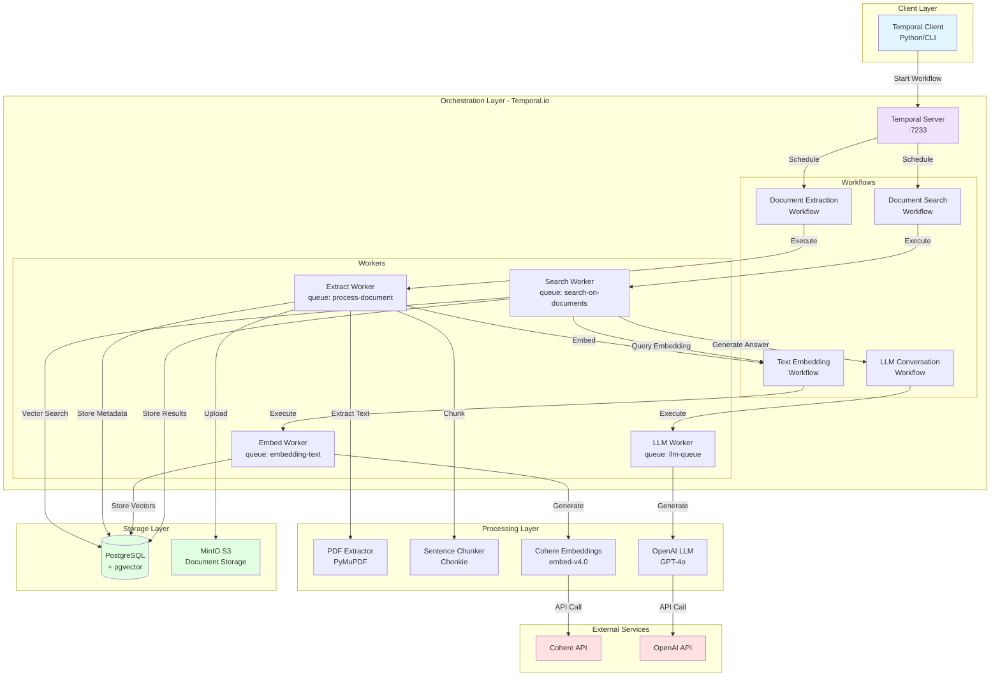
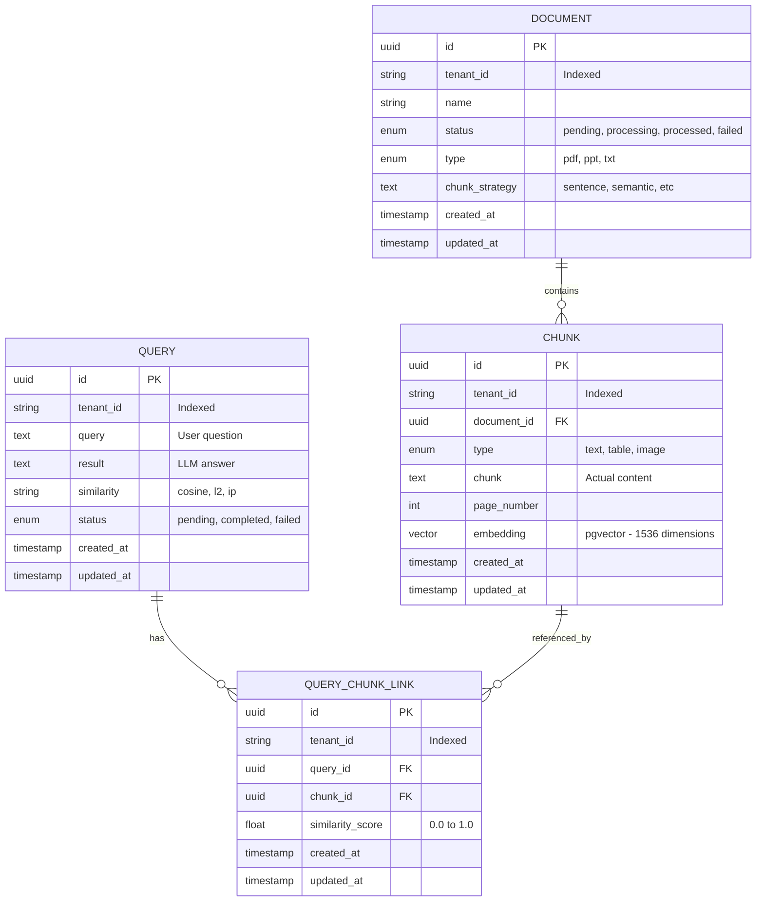
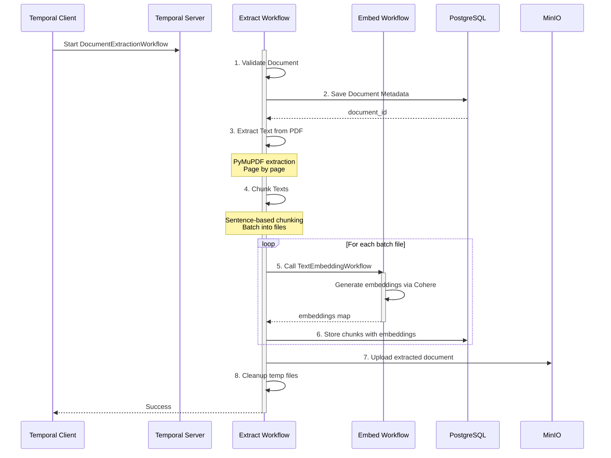
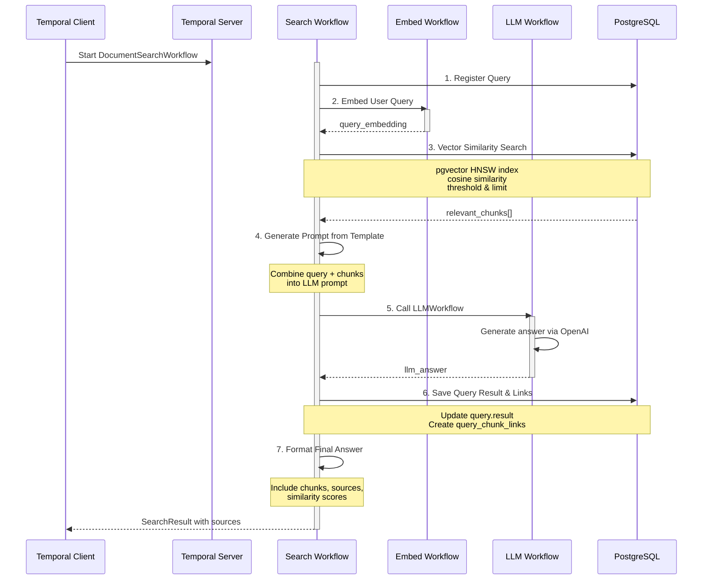

# GDAI: Multi-Tenant Vector Store with Auditable Semantic Search

GDAI is an open-source platform designed to provide a robust, multi-tenant vector store with advanced document processing and semantic search capabilities. It leverages Retrieval-Augmented Generation (RAG) and Temporal.io workflows to deliver accurate, auditable answers with full source traceability.

[](https://github.com/winnin/gdai/actions/workflows/tests.yml)
[](https://github.com/winnin/gdai/actions/workflows/pre-commit.yml)
[](https://codecov.io/gh/winnin/gdai)


---

## 📑 Table of Contents

- [Purpose](#purpose)
- [Key Features](#key-features)
- [Architecture](#architecture)
  - [System Overview](#system-overview)
  - [Database Schema](#database-schema)
  - [Workflow Orchestration](#workflow-orchestration)
- [Getting Started](#getting-started)
- [Triggering Workflows](#triggering-workflows)
- [Documentation](#documentation)
- [Contributing](#contributing)

---

## 🎯 Purpose

- **Multi-Tenant Vector Store:** Manage isolated data and search spaces for multiple organizations or users.
- **Semantic Document Processing:** Go beyond RAG by incorporating various semantic approaches for document understanding and retrieval.
- **Auditable Answers:** Every answer is traceable to its source, ensuring transparency and trust.
- **Workflow Orchestration:** Temporal.io workflows provide reliable, scalable, and observable document processing pipelines.

---

## ✨ Key Features

- **🏢 Tenant Management:** Complete data isolation for different clients or projects
- **📄 Document Ingestion:** Process and embed documents from various formats (PDF, and more coming)
- **🔍 Semantic Search:** Vector similarity search with pgvector and advanced semantic techniques
- **🤖 RAG (Retrieval-Augmented Generation):** Combine retrieval with OpenAI models for context-aware answers
- **📊 Source Traceability:** Every answer includes references to original documents and locations
- **🔄 Workflow-Based Processing:** Temporal.io workflows for reliable, scalable document processing
- **📈 Auditing:** Built-in mechanisms to audit and review the provenance of answers
- **🔌 Programmable:** Trigger workflows programmatically via Temporal Python client

---

## 🏗️ Architecture

### System Overview



### Component Breakdown

| Layer             | Components                            | Technology                       |
| ----------------- | ------------------------------------- | -------------------------------- |
| **Orchestration** | Workflow Engine, Workers              | Temporal.io                      |
| **Processing**    | Extractors, Chunkers, Embedders, LLMs | PyMuPDF, Chonkie, Cohere, OpenAI |
| **Storage**       | Database, Object Storage              | PostgreSQL + pgvector, MinIO     |

---

### Database Schema



#### Multi-Tenancy

All tables include a `tenant_id` column (indexed) to ensure complete data isolation between tenants. Every workflow execution is scoped by tenant ID to maintain data boundaries.

#### Vector Search

The `chunk.embedding` column uses pgvector with HNSW index for fast approximate nearest neighbor search:

```sql
CREATE INDEX ON chunk USING hnsw (embedding vector_cosine_ops);
```

---

### Workflow Orchestration

#### Document Extraction Workflow



#### Search Workflow



#### Temporal Workers

Each workflow runs on dedicated worker queues for scalability and isolation:

| Worker         | Queue                       | Workflow                   | Purpose                        |
| -------------- | --------------------------- | -------------------------- | ------------------------------ |
| Extract Worker | `process-document-queue`    | DocumentExtractionWorkflow | PDF extraction, chunking       |
| Embed Worker   | `embedding-text-queue`      | TextEmbeddingWorkflow      | Generate embeddings via Cohere |
| Search Worker  | `search-on-documents-queue` | DocumentSearchWorkflow     | Semantic search + RAG          |
| LLM Worker     | `llm-queue`                 | LLMWorkflow                | Generate answers via OpenAI    |

---

## 🚀 Getting Started

### Prerequisites

- **Python 3.12+**
- **Docker & Docker Compose**
- **API Keys:** Cohere (embeddings), OpenAI (LLM)

### Installation

1. **Clone the repository:**

   ```bash
   git clone https://github.com/winnin/gdai.git
   cd gdai
   ```

2. **Create virtual environment and install dependencies:**

   ```bash
   uv venv
   source .venv/bin/activate  # On Windows: .venv\Scripts\activate
   uv sync --all-groups
   ```

3. **Configure development environment:**

   ```bash
   task configure-dev
   ```

4. **Set up environment variables:**

   ```bash
   cp .env.example .env
   # Edit .env with your API keys:
   # - EMBEDDING_API_KEY (Cohere)
   # - LLM_API_KEY (OpenAI)
   ```

5. **Start infrastructure services:**

   ```bash
   docker compose up -d
   ```

6. **Setup database:**

   ```bash
   task setup-db
   ```

7. **Start Temporal workers:**

   ```bash
   task temporal-all
   ```

   This starts:

   - ✅ PostgreSQL + pgvector (port 5555)
   - ✅ Temporal Server (port 7233, UI: 8233)
   - ✅ MinIO (port 9000, console: 9001)
   - ✅ All Temporal workers

8. **Access Temporal Web UI:**

   Open your browser at: **http://localhost:8233**

---

## 🔌 Triggering Workflows

GDAI is a workflow-based processing system. You can trigger workflows programmatically using the Temporal Python client or via the Temporal CLI.

### Using the Temporal Python Client

#### Document Processing Example

```python
from temporalio.client import Client
from gdai.temporal.document_management.workflows import DocumentExtractionWorkflow
from gdai.temporal.document_management.schemas import DocumentExtractionInput

async def process_document():
    # Connect to Temporal server
    client = await Client.connect("localhost:7233")

    # Prepare workflow input
    workflow_input = DocumentExtractionInput(
        tenant_id="my-tenant",
        document_path="/path/to/document.pdf",
        document_name="document.pdf",
        chunk_strategy="sentence"
    )

    # Start the workflow
    handle = await client.start_workflow(
        DocumentExtractionWorkflow.run,
        workflow_input,
        id=f"document-extraction-{document_id}",
        task_queue="process-document-queue"
    )

    # Wait for completion
    result = await handle.result()
    print(f"Document processed: {result.document_id}")
    return result

# Run the workflow
import asyncio
asyncio.run(process_document())
```

#### Semantic Search Example

```python
from temporalio.client import Client
from gdai.temporal.document_management.workflows import DocumentSearchWorkflow
from gdai.temporal.document_management.schemas import DocumentSearchInput

async def search_documents():
    # Connect to Temporal server
    client = await Client.connect("localhost:7233")

    # Prepare search input
    search_input = DocumentSearchInput(
        tenant_id="my-tenant",
        query="What are the main findings?",
        max_num_chunks=5,
        similarity_threshold=0.7,
        similarity_metric="cosine"
    )

    # Start the search workflow
    handle = await client.start_workflow(
        DocumentSearchWorkflow.run,
        search_input,
        id=f"search-{query_id}",
        task_queue="search-on-documents-queue"
    )

    # Wait for results
    result = await handle.result()

    # Process results
    print(f"Answer: {result.answer}")
    print(f"\nSources ({len(result.chunks)} chunks):")
    for chunk in result.chunks:
        print(f"  - Document: {chunk.document_name}")
        print(f"    Page: {chunk.page_number}")
        print(f"    Similarity: {chunk.similarity_score:.3f}")
        print(f"    Text: {chunk.text[:100]}...")

    return result

# Run the search
import asyncio
asyncio.run(search_documents())
```

### Using Temporal CLI

You can also trigger workflows using the Temporal CLI:

#### Document Processing via CLI

```bash
temporal workflow start \
  --task-queue process-document-queue \
  --type DocumentExtractionWorkflow \
  --workflow-id document-extraction-123 \
  --input '{
    "tenant_id": "my-tenant",
    "document_path": "/path/to/document.pdf",
    "document_name": "document.pdf",
    "chunk_strategy": "sentence"
  }'
```

#### Search via CLI

```bash
temporal workflow start \
  --task-queue search-on-documents-queue \
  --type DocumentSearchWorkflow \
  --workflow-id search-456 \
  --input '{
    "tenant_id": "my-tenant",
    "query": "What are the main findings?",
    "max_num_chunks": 5,
    "similarity_threshold": 0.7,
    "similarity_metric": "cosine"
  }'
```

#### Query Workflow Results

```bash
# Check workflow status
temporal workflow describe --workflow-id document-extraction-123

# Get workflow result
temporal workflow show --workflow-id document-extraction-123
```

### Workflow Input Parameters

#### DocumentExtractionWorkflow

| Parameter      | Type   | Description                                  | Required |
| -------------- | ------ | -------------------------------------------- | -------- |
| tenant_id      | string | Tenant identifier for data isolation         | Yes      |
| document_path  | string | Path to the document file                    | Yes      |
| document_name  | string | Name of the document                         | Yes      |
| chunk_strategy | string | Chunking strategy (sentence, semantic, etc.) | Yes      |

#### DocumentSearchWorkflow

| Parameter            | Type   | Description                           | Required |
| -------------------- | ------ | ------------------------------------- | -------- |
| tenant_id            | string | Tenant identifier for data isolation  | Yes      |
| query                | string | User search query                     | Yes      |
| max_num_chunks       | int    | Maximum number of chunks to retrieve  | No       |
| similarity_threshold | float  | Minimum similarity score (0.0 to 1.0) | No       |
| similarity_metric    | string | Metric to use (cosine, l2, ip)        | No       |

---

## 📚 Documentation

- [Contributing Guidelines](docs/contributing.md)
- [Code of Conduct](docs/code_of_conduct.md)
- [About GDAI](docs/about.md)
- [Changelog](CHANGELOG.md)
- [Roadmap](ROADMAP.md)
- [Scripts Documentation](gdai/scripts/README.md)
- [GitHub Actions Setup](docs/github-actions.md)
- [CodeCov Setup](docs/codecov-setup.md)

---

## 🧪 Testing

```bash
# Quick tests (unit, ~3 seconds)
task tests-quick

# All tests with coverage
task tests

# Specific test suites
task tests-unit
task tests-integration
```

---

## 🛠️ Development Workflow

### Day-to-day Development

```bash
# Start infrastructure services
docker compose up -d

# Start Temporal workers
task temporal-all

# In another terminal, run tests frequently
task tests-quick

# Make changes, run full tests before committing
task tests

# Stop everything
docker compose down
```

### Common Tasks

| Task                 | Command             |
| -------------------- | ------------------- |
| Start infrastructure | `task dev-infra`    |
| Run all workers      | `task temporal-all` |
| Run tests            | `task tests`        |
| Quick tests          | `task tests-quick`  |
| Setup database       | `task setup-db`     |
| Reset database ⚠️    | `task reset-db`     |

---

## 🤝 Contributing

We welcome contributions! Please read our [Contributing Guidelines](docs/contributing.md) and [Code of Conduct](docs/code_of_conduct.md) before submitting PRs.

### Quick Start for Contributors

1. Fork the repository
2. Create a feature branch: `git checkout -b feature/amazing-feature`
3. Make your changes and add tests
4. Run tests: `task tests`
5. Commit with conventional commits: `git commit -m "feat: add amazing feature"`
6. Push and create a Pull Request

---

## 📄 License

This project is licensed under the MIT License - see the [LICENSE](LICENSE) file for details.

---

## 🙏 Acknowledgments

Built with:

- [Temporal.io](https://temporal.io/) - Workflow orchestration
- [pgvector](https://github.com/pgvector/pgvector) - Vector similarity search
- [Cohere](https://cohere.ai/) - Text embeddings
- [OpenAI](https://openai.com/) - Language models
- [LangChain](https://langchain.com/) - LLM orchestration
- [PyMuPDF](https://pymupdf.readthedocs.io/) - PDF processing
- [Chonkie](https://github.com/bhavnicksm/chonkie) - Text chunking

---

## 📞 Support

- 📖 [Documentation](docs/)
- 🐛 [Issue Tracker](https://github.com/winnin/gdai/issues)
- 💬 [Discussions](https://github.com/winnin/gdai/discussions)

---

**Made with ❤️ by the GDAI Team**
